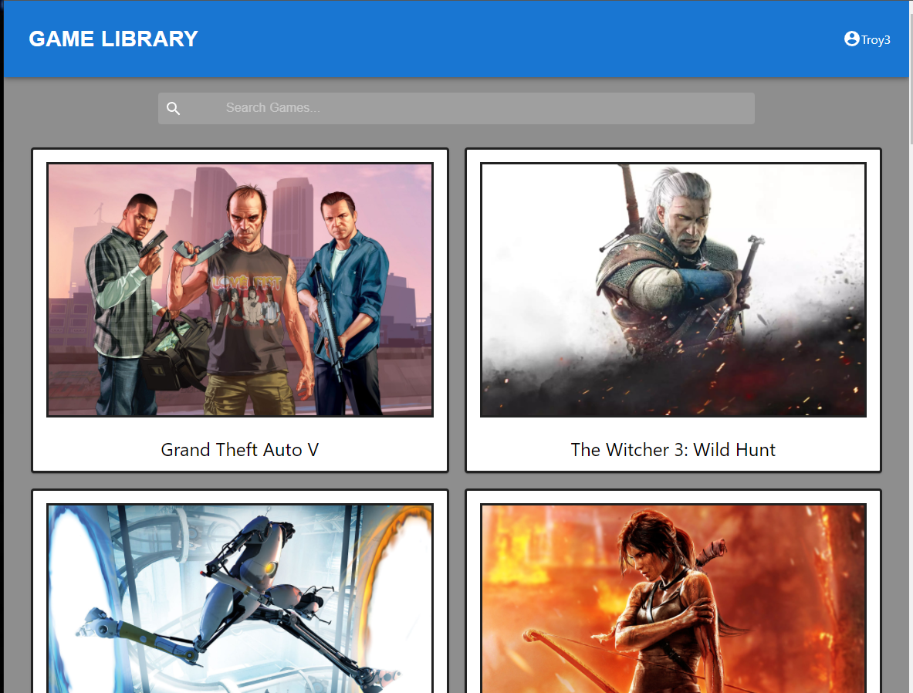

# ATTS Games

## Developed By: Sam Morgen, Timothy Sepulvado, Andrew Bwogi, Troy Grossi

 
 

# Description

ATTS Games brings a simple and intuitive game search application to your browser. By utilizing a database containing almost every known game, the user can search, discover, and save games to their unique profile. The application follows the structure of a standard MERN stack(MongoDB, Express, React, and Node).

# Table of Contents

- [Installation](#installation)

- [Usage](#usage)

- [Contribution](#contribution)

- [License](#license)

<!---->

- [Questions](#questions)

# Installation

1) Download the project from github. 
2) Must have node, mongo db, and npm installed and configured on your client. 
3) Type "npm install" from the root of the server directory and the client directory. 
- Note, npm install must be done in both directories in order to install all required dependencies. 
4) You must then create two .env files. 
- The first .env file will go in the root of the server directory 
- The second will go in the root of the client directory. 
5) The server side .env file must contain a variable called SECRET. The SECRET variable can equal any string of characters and it is used as your web token authentication validator. 
- An exmple of how this could look is ( SECRET='mysecret'). Type this into the first line of the server side .env file and then save the file.  
6) The client side .env file must contain a variable called REACT_APP_API_KEY. The REACT_APP_API_KEY variable must equal your unique api key from https://rawg.io/apidocs
- Click the Get API Key button and follow the instructions to get your own api key for this third party API
- An exmple of how this could look is ( SREACT_APP_API_KEY=a1b2c3d4e5f6g7h8i9). Type this into the first line of the server side .env file and then save the file. 
7) Begin launching the app by first typing (npm start) in the terminal from the root of the server directory
8) Then, type (npm start) in the terminal from the root of the client directory

### Dependencies: 
#### Server Side:
- apollo-server-express
- bcrypt
- dotenv
- express
- graphql
- jsonwebtoken
- mongoose
#### Client Side:
- @apollo/client
- @emotion/react
- @emotion/styled
- @material-ui/core
- @material-ui/icons
- @mui/icons-material
- @mui/material
- @testing-library/jest-dom
- @testing-library/react
- @testing-library/user-event"
- babel
- graphql
- jsx
- jwt-decode
- react
- react-dom
- react-router-dom
- react-scripts
- web-vitals
 ##### *note: Not every client side dependency is being used. They are left in to be used for future developments*

# Usage
### Operator:
- Begin launching the app by first typing (npm start) in the terminal from the root of the server directory
- Then, type (npm start) in the terminal from the root of the client directory
- Navigate to  http://localhost:3001 in the browser to access the application user interface
- Navigate to http://localhost:3001/graphql in the browser to access the graphql interface
### Client:
- The Home page will display popular games for the user to choose from
- The user can search for games by name by typing them in the search bar at the top of the page
- Based on their search, a list of similar game titles will render for the user to view
- By cicking on a game, the user can view an enlarged picture and the description of the game
- The user can sign up by clicking the navigation menu on the upper right and selecting the signup link
- The user can sign in by clicking the navigation menu on the upper right and selecting the signin link. 
- Once the user is logged in, they have the ability to add games to their profile, as well as, delete games from their profile

<!---->

Screenshot:

<!---->

# Contribution

Refer to:
[Contribution Convenant](https://www.contributor-covenant.org/version/2/0/code_of_conduct/code_of_conduct.md)

# License

MIT

# Questions

Ask questions at our github

- GitHub Link: https://github.com/quasse/game-search
